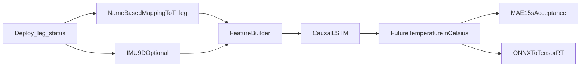

# 天工 Ultra 腿部（12 关节）热动力学 LSTM 建模规格书

> **基准文档**: `docs/plan.md`  
> **适用范围**: `TienKung Ultra` 腿部 `12` 个关节  
> **监督信号**: `bodyctrl_msgs/msg/MotorStatus.temperature`，单标量 `float32`，单位 `°C`  
> **模型约束**: 因果 `LSTM`，禁用 `BiLSTM`，不引入 G1/29DOF/双温度通道正文方案  
> **验收口径**: 未来 `15 s`，`12` 关节等权平均 `MAE <= 1.5°C`，单次前向推理 `<= 5 ms`

---

## 1. 问题定义

### 1.1 建模目标

给定某一腿部关节 `T_leg[i]` 在过去 `L` 个时间步的观测与派生特征序列

\[
\mathbf{X}^{(i)}_t = \left\{x^{(i)}_{t-L+1}, \ldots, x^{(i)}_t\right\}, \quad i \in \{0,\ldots,11\}
\]

预测该关节未来多个视距上的温度标量轨迹

\[
f_\theta\!\left(\mathbf{X}^{(i)}_t, i\right) \rightarrow \hat{\mathbf{y}}^{(i)}_t \in \mathbb{R}^{H}
\]

其中

\[
\hat{\mathbf{y}}^{(i)}_t =
\left[\hat{T}^{(i)}_{t+h_1}, \hat{T}^{(i)}_{t+h_2}, \ldots, \hat{T}^{(i)}_{t+h_H}\right]
\]

所有温度量均以 `°C` 表示，并直接对应 `MotorStatus.temperature` 的工程含义。

### 1.2 采样与预测视距

- 统一训练网格采用 `20 Hz`。
- 输入窗口长度固定为 `L = 100`，对应约 `5 s` 历史。
- 预测 horizon 采用 `H = 9` 个视距点，对应步数 `h = [10, 20, 40, 60, 100, 140, 200, 240, 300]`。
- 在 `20 Hz` 下，上述 horizon 对应 `0.5 s, 1.0 s, 2.0 s, 3.0 s, 5.0 s, 7.0 s, 10.0 s, 12.0 s, 15.0 s`。
- 主验收仅看 `15.0 s` 对应视距与 `12` 关节等权平均 `MAE`。

### 1.3 工程约束

| 指标 | 要求 |
|:-----|:-----|
| 主验收指标 | `15 s` 视距、12 关节等权平均 `MAE <= 1.5°C` |
| 训练损失 | 关节级 `Huber + MAE`，支持 `w_0..w_11` 训练权重 |
| 推理因果性 | 仅使用 `t` 时刻及之前的数据 |
| 模型时延 | 单次前向 `<= 5 ms`（FP16） |
| 数据边界 | 原始观测仅来自 `Deploy_Tienkung` 与 `TienKung-Lab` 中已明示接口 |

### 1.4 因果性与接口边界

- 禁止使用未来帧、双向循环网络或任何离线平滑结果作为在线特征。
- `TienKung-Lab` 不提供可作为监督的电机温度真值；温度标签仅能来自 Deploy 的 `/leg/status`。
- 所有特征必须可由 `plan.md` 白名单中的字段或其确定性后处理得到。

---

## 2. 系统边界与关节顺序

### 2.1 `T_leg[0..11]` 的唯一顺序

腿部温度向量 `T_leg` 的顺序唯一以 `Ultra` 为准，并与 `configs/leg_index_mapping.yaml` 对齐：

| 下标 | 关节名 |
|:----:|:-------|
| 0 | `hip_roll_l_joint` |
| 1 | `hip_yaw_l_joint` |
| 2 | `hip_pitch_l_joint` |
| 3 | `knee_pitch_l_joint` |
| 4 | `ankle_pitch_l_joint` |
| 5 | `ankle_roll_l_joint` |
| 6 | `hip_roll_r_joint` |
| 7 | `hip_yaw_r_joint` |
| 8 | `hip_pitch_r_joint` |
| 9 | `knee_pitch_r_joint` |
| 10 | `ankle_pitch_r_joint` |
| 11 | `ankle_roll_r_joint` |

Deploy 中腿部中间向量的髋关节顺序是 `roll-pitch-yaw`，与 Ultra 的 `roll-yaw-pitch` 不一致，因此：

- 禁止直接把 Deploy 腿向量下标当作 `T_leg[i]`。
- 必须先依据关节语义名或 `CAN id -> name` 的固定映射，将 Deploy 数据重排到 `T_leg[i]`。
- `ct_scale[j]` 也必须先在 Deploy 下标空间对齐，再映射到 Ultra 下标 `i`。

### 2.2 核心数据流



### 2.3 原始观测白名单

| 逻辑量 | 来源 | 说明 |
|:-------|:-----|:-----|
| `q` | `one.pos` | 关节位置 |
| `dq` | `one.speed` | 关节角速度 |
| `current` | `one.current` | 电流 |
| `tau_est` | `current * ct_scale[j]` | 估计力矩 |
| `T` | `one.temperature` | 温度标量，单位 `°C` |
| `imu_9d` | `/imu/status` | 姿态角、角速度、线加速度共 `9` 维，可选 |

### 2.4 禁止直接纳入基线模型的量

以下量不得写入基线模型输入，除非先被正式纳入 `plan.md` 白名单：

- 电压 `vol`
- 原生 `ddq` 话题
- BMS、主板温度、风扇状态
- 外置温湿度计
- 第三方机器人或旧版 G1 相关字段
- Lab 中不存在的虚构热标签

---

## 3. 物理先验与特征工程

### 3.1 单温度通道下的物理直觉

虽然实测接口仅提供单个温度标量 `T`，仍可用简化热平衡关系指导特征选择：

\[
C \frac{dT}{dt} = \alpha \tau_{est}^2 + \beta \lvert dq \rvert + \gamma \lvert ddq \rvert - k\left(T - T_{amb}^{proxy}\right) + q_{adj}
\]

其中：

- `tau_est^2` 对应负载电流引起的电气发热代理。
- `|dq|` 对应与速度相关的机械损耗代理。
- `|ddq|` 对应动态冲击和工况切换强度。
- `T` 记录当前热状态。
- `q_adj` 表示同侧相邻腿关节带来的结构热耦合。
- `T_amb^{proxy}` 不直接建模为环境温度；基线仅允许通过 IMU 上下文间接提供整体工况信息。

### 3.2 每关节基线特征

对每个关节 `T_leg[i]`，在时间步 `t` 形成如下基线特征：

| 特征名 | 定义 | 维度 | 备注 |
|:-------|:-----|:----:|:-----|
| `q` | `one.pos` | 1 | 原始位置 |
| `dq` | `one.speed` | 1 | 原始角速度 |
| `tau_est` | `one.current * ct_scale[j]` | 1 | 估计力矩 |
| `T` | `one.temperature` | 1 | 当前温度 `°C` |
| `tau_sq` | `tau_est ** 2` | 1 | 焦耳热代理 |
| `dq_abs` | `abs(dq)` | 1 | 机械损耗代理 |
| `ddq_abs` | `abs(diff(dq) / dt)` | 1 | 仅可由 `speed` 数值差分得到 |

基线输入维度为 `D_base = 7`。

### 3.3 可选上下文特征

#### 3.3.1 同侧相邻关节温度

可选加入同侧相邻关节的当前温度作为热耦合上下文：

- 左腿只与左腿相邻，右腿只与右腿相邻。
- 采用两槽位 `T_prev_same_side` 与 `T_next_same_side`。
- 边界关节缺少某一侧邻居时，使用最近的有效同侧邻居温度镜像填充。
- 该增强版输入维度为 `D_adj = 2`，总维度为 `D = 9`。

#### 3.3.2 IMU 9 维上下文

可选拼接以下 `9` 维全局上下文：

- `euler.yaw`, `euler.pitch`, `euler.roll`
- `angular_velocity.x`, `angular_velocity.y`, `angular_velocity.z`
- `linear_acceleration.x`, `linear_acceleration.y`, `linear_acceleration.z`

若启用 IMU，上述 `9` 维在序列维度上与每个关节特征对齐拼接：

- 仅基线特征: `D = 7`
- 基线 + 邻域: `D = 9`
- 基线 + IMU: `D = 16`
- 基线 + 邻域 + IMU: `D = 18`

### 3.4 预处理约定

| 项目 | 规则 |
|:-----|:-----|
| 降采样 | 所有原始序列统一到 `20 Hz` |
| `ddq_abs` | 由相邻帧 `dq` 数值差分后取绝对值 |
| 温度平滑 | 对 `T` 可选使用 `EMA(alpha = 0.05)` |
| 裁剪 | 仅允许对明显异常值做工程裁剪，需保留原值日志 |
| 归一化 | 使用训练集统计量做 `Z-score` |

EMA 公式为

\[
S_t = \alpha Y_t + (1 - \alpha) S_{t-1}, \quad \alpha = 0.05
\]

### 3.5 张量组织

- 训练样本以 `(session, joint_index, start_t)` 为单位切片。
- 单个样本输入形状为 `[L, D]`。
- 批量训练输入形状为 `[B, L, D]`。
- 标签形状为 `[B, H]`，表示该关节未来多个视距的温度。
- 若部署时希望一次前向处理全部 `12` 关节，可在实现层将关节维折叠进 batch 维，不改变文档规定的监督形式。

---

## 4. 模型架构

### 4.1 设计选择

本文采用“共享骨干 + 12 关节轻量输出头”的因果 LSTM 结构：

- 共享骨干负责学习通用热惯性和工况变化规律。
- 每个 `T_leg[i]` 使用独立线性输出头保留关节差异。
- 输入仍为单关节窗口 `[B, L, D]`，但前向时需要提供 `joint_index` 选择对应输出头。

该设计兼顾：

- `12` 个腿关节之间的统计共享；
- 对不同关节热动态差异的建模能力；
- 在线部署时较小的参数量与稳定的推理时延。

### 4.2 网络拓扑

```text
Input: state_seq (B, L, D), joint_index (B,)
        │
        ▼
Linear(D -> d_proj)
LayerNorm
GELU
        │
        ▼
Causal LSTM
input_size = d_proj
hidden_size = d_hidden
num_layers = 2
batch_first = True
dropout = p_drop
        │
        ▼
Take last hidden state (B, d_hidden)
        │
        ▼
JointSpecificHead[joint_index]
Linear(d_hidden -> d_mid)
GELU
Linear(d_mid -> H)
        │
        ▼
Predicted future temperature in Celsius: (B, H)
```

### 4.3 推荐超参数

| 超参数 | 推荐值 | 说明 |
|:-------|:------:|:-----|
| `L` | `100` | 5 秒历史窗口 |
| `H` | `9` | 对应 `0.5 s` 到 `15 s` |
| `d_proj` | `32` | 输入投影维度 |
| `d_hidden` | `96` | LSTM 隐层维度 |
| `n_layers` | `2` | LSTM 层数 |
| `p_drop` | `0.10` | Dropout |
| `d_mid` | `64` | 输出头中间层维度 |
| 参数规模 | `~110K` | 共享骨干 + 12 头，量级可控 |

### 4.4 PyTorch 参考定义

```python
import torch
import torch.nn as nn


class UltraThermalLSTM(nn.Module):
    def __init__(
        self,
        input_dim: int = 7,
        proj_dim: int = 32,
        hidden_dim: int = 96,
        num_layers: int = 2,
        dropout: float = 0.10,
        mid_dim: int = 64,
        horizon: int = 9,
        n_joints: int = 12,
    ) -> None:
        super().__init__()
        self.input_proj = nn.Sequential(
            nn.Linear(input_dim, proj_dim),
            nn.LayerNorm(proj_dim),
            nn.GELU(),
        )
        self.lstm = nn.LSTM(
            input_size=proj_dim,
            hidden_size=hidden_dim,
            num_layers=num_layers,
            batch_first=True,
            dropout=dropout if num_layers > 1 else 0.0,
        )
        self.heads = nn.ModuleList(
            [
                nn.Sequential(
                    nn.Linear(hidden_dim, mid_dim),
                    nn.GELU(),
                    nn.Linear(mid_dim, horizon),
                )
                for _ in range(n_joints)
            ]
        )

    def forward(self, x: torch.Tensor, joint_index: torch.Tensor) -> torch.Tensor:
        x = self.input_proj(x)           # (B, L, d_proj)
        lstm_out, _ = self.lstm(x)       # (B, L, d_hidden)
        h_last = lstm_out[:, -1, :]      # (B, d_hidden)
        all_preds = torch.stack([head(h_last) for head in self.heads], dim=1)
        gather_index = joint_index.view(-1, 1, 1).expand(-1, 1, all_preds.size(-1))
        return all_preds.gather(dim=1, index=gather_index).squeeze(1)  # (B, H)
```

---

## 5. 损失函数与训练目标

### 5.1 训练损失

训练阶段对单样本采用 `Huber + MAE` 组合损失：

\[
\mathcal{L}_{joint}
= \lambda_h \cdot \operatorname{Huber}\!\left(\hat{\mathbf{y}}, \mathbf{y}\right)
+ \lambda_m \cdot \operatorname{MAE}\!\left(\hat{\mathbf{y}}, \mathbf{y}\right)
\]

推荐取值：

- `lambda_h = 0.5`
- `lambda_m = 0.5`
- `Huber delta = 1.0`

### 5.2 关节权重

若样本来自关节 `i`，训练时可使用配置权重 `w_i`：

\[
\mathcal{L}_{train}
= \frac{\sum_{b=1}^{B} w_{i_b} \cdot \mathcal{L}_{joint}^{(b)}}{\sum_{b=1}^{B} w_{i_b}}
\]

约束如下：

- 默认 `w_0 ... w_11 = 1`。
- 训练可使用非等权重平衡重点关节。
- 验收与 Gate 一律仅看 `12` 关节等权平均 `MAE`，不继承训练权重。

### 5.3 监控指标

每个 epoch 至少记录：

| 指标 | 用途 |
|:-----|:-----|
| `train_loss` | 训练收敛 |
| `val_loss` | 早停与模型选择 |
| `val_mae_per_horizon` | 各视距精度趋势 |
| `val_mae_15s_equal_weight` | 主 Gate 指标 |
| `max_ae` | 监控极端错误 |
| `latency_fp16_ms` | 推理约束验证 |

---

## 6. 数据流水线

### 6.1 从 Deploy 到训练样本的处理流程

1. 订阅 `/leg/status`，可选订阅 `/imu/status`。
2. 依据关节语义名将 Deploy 数据映射到 `T_leg[0..11]`。
3. 计算 `tau_est = current * ct_scale[j]`。
4. 将时序降采样或重采样到 `20 Hz`。
5. 对 `dq` 做数值差分得到 `ddq_abs`。
6. 计算 `tau_sq`、`dq_abs`，并可选对 `T` 执行 EMA。
7. 按 session 划分 Train / Val / Test。
8. 用滑动窗口生成 `[L, D] -> [H]` 样本。

### 6.2 建议的 HDF5 组织

```text
{session_name}.h5
├── metadata/
│   ├── sample_rate_hz          # int, 20
│   ├── source_topic            # str, /leg/status
│   ├── mapping_version         # str, Ultra_T_leg_v1
│   └── notes                   # str
├── timestamps                  # float64, shape (N,)
├── joints/
│   ├── q                       # float32, shape (N, 12)
│   ├── dq                      # float32, shape (N, 12)
│   ├── current                 # float32, shape (N, 12)
│   ├── tau_est                 # float32, shape (N, 12)
│   ├── temp_c                  # float32, shape (N, 12)
│   ├── tau_sq                  # float32, shape (N, 12)
│   └── ddq_abs                 # float32, shape (N, 12)
└── imu/
    ├── euler                   # float32, shape (N, 3)
    ├── angular_velocity        # float32, shape (N, 3)
    └── linear_acceleration     # float32, shape (N, 3)
```

说明：

- `temp_c` 是唯一温度监督字段。
- 不再定义 `temperature_0` / `temperature_1`。
- 若原始 `current` 希望保留，应与 `tau_est` 同时落盘以便追溯。

### 6.3 Dataset 参考实现

```python
import h5py
import numpy as np
import torch
from torch.utils.data import Dataset


class UltraThermalDataset(Dataset):
    def __init__(
        self,
        h5_paths: list[str],
        seq_len: int = 100,
        horizon_steps: list[int] = [10, 20, 40, 60, 100, 140, 200, 240, 300],
        use_adjacent_temp: bool = False,
        use_imu: bool = False,
        norm_stats: dict | None = None,
    ) -> None:
        self.seq_len = seq_len
        self.horizon_steps = horizon_steps
        self.max_horizon = max(horizon_steps)
        self.use_adjacent_temp = use_adjacent_temp
        self.use_imu = use_imu
        self.norm_stats = norm_stats
        self.samples: list[tuple[str, int, int]] = []

        for path in h5_paths:
            with h5py.File(path, "r") as f:
                n_frames = f["timestamps"].shape[0]
                valid_len = n_frames - seq_len - self.max_horizon
                for joint_idx in range(12):
                    for start_t in range(valid_len):
                        self.samples.append((path, joint_idx, start_t))

    def __len__(self) -> int:
        return len(self.samples)

    def __getitem__(self, idx: int):
        path, joint_idx, start_t = self.samples[idx]
        sl = slice(start_t, start_t + self.seq_len)

        with h5py.File(path, "r") as f:
            q = f["joints/q"][sl, joint_idx]
            dq = f["joints/dq"][sl, joint_idx]
            tau_est = f["joints/tau_est"][sl, joint_idx]
            temp_c = f["joints/temp_c"][sl, joint_idx]
            tau_sq = f["joints/tau_sq"][sl, joint_idx]
            ddq_abs = f["joints/ddq_abs"][sl, joint_idx]

            features = [q, dq, tau_est, temp_c, tau_sq, np.abs(dq), ddq_abs]

            if self.use_adjacent_temp:
                prev_idx, next_idx = same_side_neighbors(joint_idx)
                prev_temp = f["joints/temp_c"][sl, prev_idx]
                next_temp = f["joints/temp_c"][sl, next_idx]
                features.extend([prev_temp, next_temp])

            if self.use_imu:
                imu = np.concatenate(
                    [
                        f["imu/euler"][sl],
                        f["imu/angular_velocity"][sl],
                        f["imu/linear_acceleration"][sl],
                    ],
                    axis=-1,
                )

            x = np.stack(features, axis=-1)
            if self.use_imu:
                x = np.concatenate([x, imu], axis=-1)

            target = np.array(
                [
                    f["joints/temp_c"][start_t + self.seq_len + h - 1, joint_idx]
                    for h in self.horizon_steps
                ],
                dtype=np.float32,
            )

        x = torch.from_numpy(x).float()
        if self.norm_stats is not None:
            x = (x - self.norm_stats["mean"]) / (self.norm_stats["std"] + 1e-8)

        return x, torch.tensor(joint_idx), torch.from_numpy(target)
```

### 6.4 数据集划分

按采集 session 划分，禁止在同一 session 内拆分到不同集合：

| 划分 | 占比 | 约束 |
|:-----|:----:|:-----|
| Train | 70% | 覆盖多种工况与负载水平 |
| Val | 15% | 包含完整高负载与冷却段 |
| Test | 15% | 独立 session，训练中完全不可见 |

---

## 7. 训练协议与消融

### 7.1 优化器与训练设置

| 配置项 | 推荐值 |
|:-------|:-------|
| 优化器 | `AdamW` |
| 学习率 | `1e-3` |
| 权重衰减 | `1e-4` |
| 调度器 | `CosineAnnealingWarmRestarts(T_0=20, T_mult=2)` |
| Batch Size | `128` |
| 最大 Epoch | `200` |
| 梯度裁剪 | `max_norm = 1.0` |
| Early Stopping | `patience = 15`，监控 `val_mae_15s_equal_weight` |

### 7.2 训练伪代码

```python
model = UltraThermalLSTM(input_dim=D, horizon=9)
optimizer = torch.optim.AdamW(model.parameters(), lr=1e-3, weight_decay=1e-4)
scheduler = torch.optim.lr_scheduler.CosineAnnealingWarmRestarts(optimizer, T_0=20, T_mult=2)

best_gate = float("inf")
patience = 0

for epoch in range(200):
    model.train()
    for x, joint_idx, y in train_loader:
        pred = model(x, joint_idx)
        loss = weighted_joint_loss(pred, y, joint_idx, joint_weights)
        optimizer.zero_grad()
        loss.backward()
        torch.nn.utils.clip_grad_norm_(model.parameters(), max_norm=1.0)
        optimizer.step()
    scheduler.step()

    gate = evaluate_equal_weight_mae_15s(model, val_loader)
    if gate < best_gate:
        best_gate = gate
        patience = 0
        save_checkpoint(model, "best_ultra_thermal.pt")
    else:
        patience += 1
        if patience >= 15:
            break
```

### 7.3 建议的消融矩阵

| 实验 ID | 变量 | 基线 | 对比项 | 关注指标 |
|:--------|:-----|:-----|:-------|:---------|
| A1 | `ddq_abs` | 启用 | 移除 | `15 s MAE` |
| A2 | 邻域温度 | 关闭 | 启用 `T_prev/T_next` | `15 s MAE` |
| A3 | IMU 9 维 | 关闭 | 启用 | `15 s MAE` 与时延 |
| A4 | 序列长度 `L` | `100` | `50`, `150` | MAE 与时延 |
| A5 | `d_hidden` | `96` | `64`, `128` | MAE 与参数量 |
| A6 | 输出结构 | 12 头 | 全共享单头 | MAE 与稳定性 |

消融结论应以主 Gate 指标为核心，不得仅凭训练损失决定最终方案。

---

## 8. 离线评估与验收

### 8.1 评估指标

| 指标 | 定义 | 说明 |
|:-----|:-----|:-----|
| `MAE@h_k` | 各 horizon 的平均绝对误差 | 报告视距退化趋势 |
| `MAE_15s_equal_weight` | `h = 300` 时 12 关节等权平均 MAE | 主验收指标 |
| `MAE_high_load` | 高负载片段上的 MAE | 风险评估 |
| `MAE_cooling` | 冷却片段上的 MAE | 冷却动态评估 |
| `MaxAE` | 全测试集最大单点误差 | 安全边界观察 |
| `Latency_FP16_ms` | FP16 前向时间 | 部署门控 |

### 8.2 分关节误差热力图

误差热力图维度固定为 `12 x H`，行对应 `T_leg[0..11]`，列对应 9 个 horizon：

```text
              0.5s   1.0s   2.0s   3.0s   5.0s   7.0s   10.0s  12.0s  15.0s
hip_roll_l     ...
hip_yaw_l      ...
hip_pitch_l    ...
knee_pitch_l   ...
ankle_pitch_l  ...
ankle_roll_l   ...
hip_roll_r     ...
hip_yaw_r      ...
hip_pitch_r    ...
knee_pitch_r   ...
ankle_pitch_r  ...
ankle_roll_r   ...
```

分析重点：

- 某些关节是否在 `10 s` 之后明显失稳。
- 左右对称关节误差是否存在系统偏差。
- 高负载动作切换点是否集中产生大误差。

### 8.3 失败案例分析

对测试集 `Top-K` 大误差样本记录以下字段：

- `joint_name`
- `timestamp`
- `session_id`
- `phase / task`
- `target_temp_c`
- `pred_temp_c`
- `error_sign`

并重点排查：

- 是否为 `T_leg` 映射错误；
- 是否出现在温度快速上升或快速冷却区间；
- 是否与某个关节头部过拟合有关；
- 是否受到输入缺测或异常值影响。

---

## 9. 部署与在线推理

### 9.1 模型导出链路

```text
PyTorch (.pt)
    │
    ▼
ONNX (opset 17)
    │
    ▼
TensorRT FP16 (.engine)
```

导出时约定：

- 输入名：`state_seq`, `joint_index`
- 输出名：`temp_c_horizon`
- ONNX 与 PyTorch 数值误差应控制在 `1e-4` 量级
- TensorRT 与 ONNX 的 `MAE` 偏差应远小于 `0.1°C`

```python
dummy_x = torch.randn(1, 100, 7)
dummy_joint = torch.zeros(1, dtype=torch.long)

torch.onnx.export(
    model,
    (dummy_x, dummy_joint),
    "ultra_thermal_lstm.onnx",
    input_names=["state_seq", "joint_index"],
    output_names=["temp_c_horizon"],
    dynamic_axes={"state_seq": {0: "batch"}, "joint_index": {0: "batch"}},
    opset_version=17,
)
```

### 9.2 在线推理流水线

```text
/leg/status + /imu/status
        │
        ▼
Name-based mapping to T_leg[0..11]
        │
        ▼
Feature update at 20 Hz
        │
        ▼
Per-joint ring buffer (L = 100)
        │
        ▼
TensorRT FP16 inference
        │
        ▼
Future temperature horizons in Celsius
        │
        ▼
Thermal guard / monitoring
```

在线阶段只能消费已存在的 Deploy Topic 与字段，不得临时引入新接口。

### 9.3 热保护逻辑

```python
T_SOFT = 50.0
T_HARD = 60.0


def thermal_protection(pred_temp_c: np.ndarray) -> str:
    t_max = float(pred_temp_c.max())
    if t_max >= T_HARD:
        return "HARD_LIMIT"
    if t_max >= T_SOFT:
        return "SOFT_LIMIT"
    return "NORMAL"
```

对关节 `i` 的力矩限幅可按如下方式衰减：

\[
\tau^{eff}_{max}(i) =
\tau^{rated}_{max}(i) \cdot \operatorname{clip}\!\left(
\frac{T_{hard} - \hat{T}^{(i)}_{max}}{T_{hard} - T_{soft}},
0,
1
\right)
\]

---

## 10. 与项目工程的接口

模型文档与工程代码的对应关系建议如下：

| 领域 | 建议文件 |
|:-----|:---------|
| 映射配置 | `configs/leg_index_mapping.yaml` |
| 数据采集 | `scripts/` 下采集或检查脚本 |
| 数据集定义 | `tienkung_thermal/data/` |
| 模型定义 | `tienkung_thermal/models/thermal_lstm.py` |
| 模型超参与代码落地里程碑（方案 A） | `configs/ultra_thermal_lstm.yaml`、`docs/ultra_thermal_lstm_implementation.md` |
| 训练与评估 | `tienkung_thermal/training/` |
| 导出与部署 | `tienkung_thermal/deployment/` |

该文档只定义建模口径，不覆盖具体 Python 包布局实现；**代码落地步骤、目录规划与方案 A 配置策略**见 `docs/ultra_thermal_lstm_implementation.md`。

---

## 11. 版本要求与一致性检查

本文件完成后应始终满足以下一致性约束：

- 正文只讨论 `Ultra` 腿部 `12` 关节。
- 温度监督只使用 `MotorStatus.temperature` 单标量 `°C`。
- 不出现 `temperature[0]` / `temperature[1]` 双通道正文依赖。
- 不出现 `29` 关节、G1、电压、BMS、主板温、风扇等基线输入依赖。
- 所有 tensor 形状、horizon、验收标准均与 `docs/plan.md` 保持一致。

---

## 附录 A: `T_leg[0..11]` 关节名称速查

| 下标 | 关节名 | 侧别 | 备注 |
|:----:|:-------|:----:|:-----|
| 0 | `hip_roll_l_joint` | 左 | 髋滚转 |
| 1 | `hip_yaw_l_joint` | 左 | 髋偏航 |
| 2 | `hip_pitch_l_joint` | 左 | 髋俯仰 |
| 3 | `knee_pitch_l_joint` | 左 | 膝俯仰 |
| 4 | `ankle_pitch_l_joint` | 左 | 踝俯仰 |
| 5 | `ankle_roll_l_joint` | 左 | 踝滚转 |
| 6 | `hip_roll_r_joint` | 右 | 髋滚转 |
| 7 | `hip_yaw_r_joint` | 右 | 髋偏航 |
| 8 | `hip_pitch_r_joint` | 右 | 髋俯仰 |
| 9 | `knee_pitch_r_joint` | 右 | 膝俯仰 |
| 10 | `ankle_pitch_r_joint` | 右 | 踝俯仰 |
| 11 | `ankle_roll_r_joint` | 右 | 踝滚转 |

## 附录 B: Horizon 时间映射

| Horizon 索引 | 1 | 2 | 3 | 4 | 5 | 6 | 7 | 8 | 9 |
|:-------------|:-:|:-:|:-:|:-:|:-:|:-:|:-:|:-:|:-:|
| 未来时间（秒） | 0.5 | 1.0 | 2.0 | 3.0 | 5.0 | 7.0 | 10.0 | 12.0 | 15.0 |
| 未来步数（20 Hz） | 10 | 20 | 40 | 60 | 100 | 140 | 200 | 240 | 300 |

## 附录 C: 术语约定

- `temp_c`: 温度标量，单位 `°C`
- `tau_est`: 基于 `current * ct_scale[j]` 的估计力矩
- `tau_sq`: `tau_est` 的平方，作为焦耳热代理
- `dq_abs`: 角速度绝对值
- `ddq_abs`: 由 `dq` 数值差分得到的角加速度绝对值
- `equal_weight_mae`: 12 关节等权平均 MAE

*文档结束。若与其它旧稿冲突，以 `docs/plan.md` 与 `configs/leg_index_mapping.yaml` 为准。*
